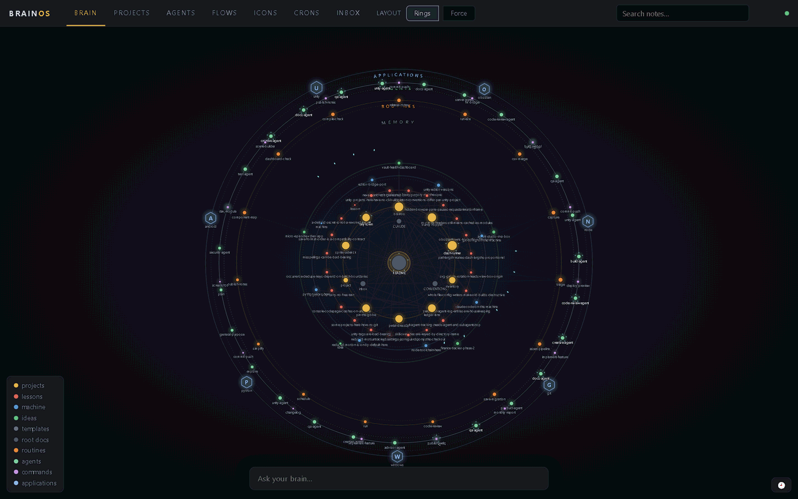

# Orrerium

[](https://github.com/cfirz/Orrerium/actions/workflows/ci.yml)

Local-first dashboard over a markdown knowledge vault: no build step, zero npm
dependencies, all state in files that both humans and AI agents can read.

Three core panels: **Brain** (interactive graph of the vault with note reader,
search, ask-your-brain, and live reload), **Projects** (a board built from
project-page frontmatter), and **Inbox** (the capture buffer with a
ready-for-triage indicator). Panels deep-link via the URL hash (`#/brain`,
`#/projects`, `#/inbox`).

If you use [Claude Code](https://claude.com/claude-code), the graph can also map
your whole machine's agent setup: `.claude/{skills,agents,commands}` across every
repo under the configured roots plus the global `~/.claude` land on an **AGENTS**
orbit, and live sessions light up the graph in real time (see
[Agents board](#agents-board)). None of that is required — the vault dashboard
works on its own.



*Above, animated and live: an example vault — 23 lessons, 9 project pages,
7 machine notes — plus a scanned Claude Code setup across eight repos. The cyan
orbit rings mark nodes that are running right now, and each travelling dot is one
working subagent's traffic: six on a WebGL game repo, four on a kids' game, and a
third session quietly triaging the vault's own inbox.*

## Quick start

```
git clone https://github.com/cfirz/Orrerium
cd Orrerium
node server.js
```

Then open http://127.0.0.1:4321. Requires Node 20+ (uses `fs.watch` recursive
and `node:test`). There is nothing to install — with no configuration, Orrerium
boots against the bundled demo vault in [starter-vault/](starter-vault/).

Prefer a double-click? [orrerium.bat](orrerium.bat) (Windows) and
[orrerium.sh](orrerium.sh) (macOS/Linux) start the server, open the browser once
it answers, and reuse an already-running instance instead of starting a second
one. The server runs in that window — Ctrl+C or closing it stops the server.

## First-time setup

Three steps, all offline — no accounts, no API keys, nothing to install.

**1. Install Node.js** — version 20 or newer, from
[nodejs.org](https://nodejs.org). To check what you have:

```
node -v      # should print v20.x or higher
```

**2. Download Orrerium** — on the
[GitHub page](https://github.com/cfirz/Orrerium), click **Code → Download ZIP**
and unzip it anywhere. Or, if you use git:

```
git clone https://github.com/cfirz/Orrerium
```

**3. Open it** — double-click [orrerium.bat](orrerium.bat) (Windows) or run
[orrerium.sh](orrerium.sh) (macOS/Linux):

```
cd Orrerium
./orrerium.sh     # macOS / Linux — Windows: double-click orrerium.bat
```

Your browser opens on a small demo vault — click any node to read its note.

That's it. Whenever you're ready:

- **Use your own notes** — see
  [Point it at your own vault](#point-it-at-your-own-vault).
- **AI questions over your notes** (optional) — see
  [AI features](#ai-features-optional).
- **Live agent tracking** (optional, Claude Code users) — see
  [Agents board](#agents-board).

### Troubleshooting

- **`vaultPath is not a directory`** — the vault path you set doesn't exist
  (or `config.json` points somewhere stale). Remember `~` is not expanded in
  `config.json`.
- **`Port 4321 is already in use`** — another Orrerium (or something else) owns
  the port. Stop it, or set `port` in `config.json`. If hooks should reach a
  non-default port, also set `ORRERIUM_PORT` where the hooks run.
- **Errors on startup** — almost always Node older than 20; check `node -v`.
- **Agents / Flows / Icons panels are empty** — expected until the
  [Agents board](#agents-board) hooks are installed and a Claude Code session
  runs.
- **Graph is static (no spark animations)** — your OS has reduced motion
  switched on *and* the topbar **motion** toggle is set to Auto; switch it back
  to **On** (the default). On Windows, turning "animation effects" on in
  Settings also brings the motion back.

## Point it at your own vault

Any folder of markdown files works, and Orrerium treats it as **strictly
read-only** — it never touches your notes. Either set `ORRERIUM_VAULT` when
starting the server:

```
ORRERIUM_VAULT=/path/to/your/vault node server.js     # macOS / Linux
```

```
set ORRERIUM_VAULT=C:\path\to\your\vault && node server.js    # Windows cmd
$env:ORRERIUM_VAULT="C:\path\to\your\vault"; node server.js   # PowerShell
```

or, for a permanent setting, copy
[config.example.json](config.example.json) to `config.json` (gitignored) and
set `vaultPath`. Use absolute paths in `config.json` — `~` is not expanded.

You get the most out of the dashboard when the vault follows the conventions the
UI understands (the bundled [starter-vault/](starter-vault/) demonstrates all of
them, and its [CONVENTIONS.md](starter-vault/CONVENTIONS.md) explains the why):

- **Type folders** — notes live in `projects/`, `lessons/`, `machine/`, `ideas/`,
  `templates/`; the folder gives the node its type, colour, and ring. Notes in
  other folders still render, just untyped.
- **A root `README.md`** — sits at the centre of the Rings layout as the vault's
  index.
- **Frontmatter** — `name`, one-line quoted `description`, `type`, `updated`;
  project pages carry `status` and `dir` (the projects board is built from
  these); `projects: ["[[slug]]"]` wikilinks cluster the graph.
- **An `inbox.md` capture buffer** — feeds the Inbox panel, with `capture` and
  `triage` skills under `.claude/skills/` (rendered as ROUTINE nodes).

To adopt the whole system, copy `starter-vault/` somewhere, delete the sample
notes, and start capturing.

### Configuration reference

| Key | Default | Meaning |
|---|---|---|
| `vaultPath` | `starter-vault` | Markdown vault to visualize (relative paths resolve from the repo root; `ORRERIUM_VAULT` overrides) |
| `host` / `port` | `127.0.0.1` / `4321` | Where the dashboard listens — keep it on loopback, see [SECURITY.md](SECURITY.md) |
| `excludeDirs` | `.obsidian`, `.claude`, `.git` | Folders never scanned (skills are scanned explicitly) |
| `applicationTags` | `unity`, `python`, … | Tags that become APPLICATION nodes on the outer ring |
| `ai.provider` | `auto` | `api` (Claude API via `ANTHROPIC_API_KEY`), `cli` (local `claude` CLI / Claude Code login), or `auto` (api if the key is set, else cli) |
| `ai.model` | `claude-opus-5` | Model for the API provider (the CLI uses its own configured model) |
| `claudeScan.roots` | `[]` | Dirs whose children are scanned (one level) for `.claude/{skills,agents,commands}` — absolute paths, e.g. `["C:/code"]` or `["/Users/you/code"]` |
| `claudeScan.globalDir` | `~/.claude` | The global Claude dir, scanned the same way |
| `claudeScan.settingsPath` | `~/.claude/settings.json` | Read for `skillOverrides` so disabled skills render dormant |
| `claudeScan.rescanMs` | `300000` | External repos are re-scanned on this cadence (no watchers) |

## AI features (optional)

Two features talk to an LLM; everything else is fully offline.

- **Ask-your-brain** (`#/brain`, ask box) needs either `ANTHROPIC_API_KEY` set in
  the environment, or the [Claude Code](https://claude.com/claude-code) CLI
  installed and logged in (`ai.provider` picks; `auto` prefers the key).
- **Crons** (`#/crons`) runs headless `claude -p` jobs and always needs the CLI.

**Privacy note:** ask-your-brain builds its context from the *entire vault* —
every question ships your whole vault's text to the configured provider (the
Anthropic API, or whatever the `claude` CLI is logged into). Don't point Orrerium
at a vault you wouldn't send there. Very large vaults may also exceed the model's
context window; there is no retrieval fallback yet.

## Architecture (10 lines)

- `server.js` — plain `node:http`: static files (`Cache-Control: no-cache` — live edits, no stale modules), JSON routes, one SSE route.
- `lib/sse.js` — the SSE channel: named events (`broadcast(event, payload)`), one client set, keepalive pings. `public/js/bus.js` is its client twin: one shared `EventSource`, panels subscribe by event name.
- `lib/store.js` — Orrerium-owned writable state under `data/` (gitignored): atomic JSON writes (tmp+rename) and NDJSON append logs. The vault stays read-only.
- `lib/claude-scan.js` — cross-repo scanner: `.claude/{skills,agents,commands}` across `claudeScan.roots` + the global dir become **agent**/**command**/**routine** nodes (namespaced ids like `DemoApp.qa-agent`, short `label` for display), merged onto the graph with one `scan` edge to the repo's vault project note (matched on `dir` frontmatter) or a synthetic **repo** anchor.
- `lib/vault.js` — pure parser: frontmatter (vault dialect) + wikilink/md-link extraction, plus `.claude/skills/*/SKILL.md` as **routine** nodes. Importable by agents and CLIs; no http/fs.watch in it.
- `lib/graph.js` — pure: notes → `{nodes, edges, warnings}`; undirected dedupe, ghost nodes for unresolved wikilinks, degree; **application** nodes derived from `applicationTags` with tag edges to every note carrying the tag; routine edges from real markdown links and `x.md` mentions in skill bodies.
- `lib/watch.js` — debounced recursive `fs.watch`; every change triggers a full re-parse (the vault is small; incremental bookkeeping is not worth bugs).
- `lib/ask.js` — ask-your-brain: whole-vault context + question to an LLM. Two zero-dependency providers: raw HTTP to the Claude API (with prompt caching and `refusal` handling) or the local `claude` CLI. Answers cite notes as `[[wikilinks]]`, which the UI renders as graph navigation.
- `public/js/graph-view.js` — SVG graph with two layouts: **Rings** (default — concentric orbits with README at the core, then root docs, PROJECTS, LESSONS, MACHINE, IDEAS, TEMPLATES, ROUTINES, and hexagonal APPLICATIONS outermost; notes are angularly sorted toward the projects they link to) and **Force** (Obsidian-style d3-force; position cache keeps live reloads from re-exploding the layout).
- `public/js/agent-activity.js` — live agent traffic on the graph, in both layouts (see "Live agent activity"). Pure derivation: the agents SSE snapshot reduces to a set of live nodes and live edges, which `graph-view.js` paints.
- `public/js/note-panel.js` — marked with a wikilink tokenizer; every in-vault link navigates the graph.
- `public/js/search.js` — substring filter over id/description/tags.
- `public/vendor/` — committed single-file builds of d3 and marked ([versions and licenses](public/vendor/README.md)).
- The vault's `.obsidian/graph.json` was the design reference for colours/forces; it is **never read or written at runtime** (Obsidian clobbers it).
- `public/js/panels.js` + `projects-panel.js` + `inbox-panel.js` — the dashboard shell: a topbar nav switches panels; the projects board renders from graph-node frontmatter (`status`, `dir`, tags, degree) and clicks through to the graph; the inbox view renders `inbox.md` captures and flags the triage threshold. The ask panel is multi-turn — prior Q/A pairs ride along with each request.
- `window.orrerium` in the browser console exposes the view, graph data and simulation for debugging.

## Agents board

*This whole section is Claude Code-specific and entirely optional — without the
hook setup below, the Agents, Flows and Icons panels are simply empty.*

`#/agents` shows every Claude Code session on the machine live: the
orchestrator's current activity, spawned subagents and their status, tool and
error counts. It is fed by Claude Code hooks posting to `/api/hook-event`
through [hooks/emit.js](hooks/emit.js) — a fire-and-forget emitter that always
exits 0 and swallows every failure, so sessions never notice when Orrerium is
down (a PreToolUse hook that exits non-zero would block the tool call).

To enable, add hook entries to `~/.claude/settings.json` for **all seven**
events — `SessionStart`, `UserPromptSubmit`, `PreToolUse` (matcher `*`),
`PostToolUse` (matcher `*`), `SubagentStop`, `Stop`, `SessionEnd` — each running
the same command (replace the path with your clone's absolute path):

```json
"hooks": {
  "SessionStart": [{ "hooks": [
    { "type": "command", "command": "node \"/path/to/Orrerium/hooks/emit.js\"", "timeout": 5 }
  ]}],
  "UserPromptSubmit": [{ "hooks": [
    { "type": "command", "command": "node \"/path/to/Orrerium/hooks/emit.js\"", "timeout": 5 }
  ]}],
  "PreToolUse": [{ "matcher": "*", "hooks": [
    { "type": "command", "command": "node \"/path/to/Orrerium/hooks/emit.js\"", "timeout": 5 }
  ]}],
  "PostToolUse": [{ "matcher": "*", "hooks": [
    { "type": "command", "command": "node \"/path/to/Orrerium/hooks/emit.js\"", "timeout": 5 }
  ]}],
  "SubagentStop": [{ "hooks": [
    { "type": "command", "command": "node \"/path/to/Orrerium/hooks/emit.js\"", "timeout": 5 }
  ]}],
  "Stop": [{ "hooks": [
    { "type": "command", "command": "node \"/path/to/Orrerium/hooks/emit.js\"", "timeout": 5 }
  ]}],
  "SessionEnd": [{ "hooks": [
    { "type": "command", "command": "node \"/path/to/Orrerium/hooks/emit.js\"", "timeout": 5 }
  ]}]
}
```

If Orrerium listens on a non-default port, set `ORRERIUM_PORT` in the environment
the hooks run in.

Events are whitelisted and truncated server-side (`lib/agents.js`), appended to
`data/agent-events/YYYY-MM-DD.ndjson`, and replayed on server start so a
restart never blanks the board. Subagent spawns are detected as `PreToolUse` of
the `Agent` tool (older Claude Code builds called it `Task`, and log days from
back then still hold those events, so both names count — `isSubagentTool` in
`lib/agents.js`). Only `SubagentStop` closes the oldest working subagent:
`PostToolUse` is not a completion, because a backgrounded agent returns its
handle within milliseconds and keeps running.

The desktop app emits hook events of its own, so every session in the snapshot
carries a `kind` (`classifySession` in `lib/agents.js`): `work` for real
sessions, `startup` for the throwaway sessions the app opens and closes on
launch (Start+End pair, no prompt, no tools — one per recent project plus one
rooted at the home dir), and `housekeeping` for the bare-`SessionEnd` bursts
its periodic tick emits while finalizing old sessions (~every 2h at :28 past
the hour while the app is open). The board's filter chips (All · Live · Idle ·
Ended · System) keep the two system kinds out of every view except System,
which shows them labeled for what they are. Cron runs are never misclassified:
the runner posts a synthetic prompt event.

**Flows** (`#/flows`) replays the same log as a timeline: subagent spans stack
above the orchestrator lane (parallel agents get parallel lanes, packed
greedily by `lib/flows.js`), tool ticks and prompt diamonds ride lane 0, and a
scrubber replays the run (`setInterval`-driven — rAF pauses in hidden panes).
Live sessions redraw as events arrive.

**Live agent activity** paints the same snapshot onto the graph itself, in both
layouts. A live session resolves to its project node by matching `cwd` against
node `dir` (walking up parent directories, and filtered to project/repo nodes —
agent and command nodes carry their repo's `dir` too, so an unfiltered index
resolves a session to a random command). Each of its **working** subagents
resolves to that repo's agent node — same repo first, then a global agent, then
nothing, because lighting another repo's `qa-agent` would be a lie. The existing
`scan` edge between them then carries star dots from the project out to the
agent, a ring of sparks orbits every live node, and one ripple fires per spawn
or burst of tool calls. A session with **no** working subagent — the common case —
has no agent edge to carry traffic, so it radiates along its own strongest links
instead (frontmatter before body before tag, capped at four per node and picked
deterministically, or the d3 join churns and restarts every animation). Those
ambient sparks are thinner, dimmer and slower so attributable agent traffic still
reads as the stronger signal, they travel *away* from the live node whichever end
of the edge it sits on, and they deliberately do not light the far end: those
neighbours are context, not running work. Sessions decay hot → warm → dark on the
client (20s / 90s, the second matching the server's stale threshold), because a
quiet session produces no new snapshot to react to.

All of that motion is **CSS keyframes, not a JS loop** — rAF pauses in hidden
panes, so a per-frame animation would silently freeze. Travelling dots are a
near-zero dash on a copy of the edge with `pathLength="100"`, so one
`stroke-dashoffset` keyframe fits every edge length; the orbit rotates about the
node's local origin via `transform-box: view-box; transform-origin: 0 0`. Under
`prefers-reduced-motion: reduce` the decorative traffic can withdraw entirely,
with live nodes still reading as live through their static styling — but that
branch is opt-in: motion defaults to **On** and only an explicit Auto on the
topbar **motion** toggle hands the decision back to the OS. (Windows users:
switching the OS "animation effects" off makes Chrome report `reduce` for every
page, which is exactly why the sparks — the live-activity read-out itself — do
not disappear by default.)

**Icons** (`#/icons`) assigns hand-authored pixel faces
([public/js/icons.js](public/js/icons.js), 12×12 grids as data — no asset
pipeline) to scanned agents. Assignments live in `data/icon-assignments.json`
(`GET /api/icons`, `POST /api/icons/assign`) and every consumer — board rows,
graph agent nodes — repaints over the `icons` SSE event.

## Crons

`#/crons` schedules headless `claude -p` runs. The scheduler is **in-process**
(a deliberate substrate choice over the OS scheduler: every definition
and run log stays a file an agent can read; nothing to reconcile with OS
state). Definitions live in `data/crons.json` — never in the vault — with a
small schedule grammar parsed by `lib/cron-parse.js`: `every 30m`,
`daily@07:30`, `weekly@mon 09:00` (local wall-clock, DST-safe). Jobs fire only
while the server runs; a per-job **catchUp** flag runs a missed occurrence
once at startup ([lib/crons.js](lib/crons.js)). Runs never overlap themselves;
output is captured to `data/cron-runs/<id>/<ts>.log` with a tail in the run
record (`data/cron-runs/<id>.ndjson`). Each run also emits synthetic session
events, so scheduled runs appear on the Agents board and in Flows. The panel
has the job list (enable/run-now/delete), a week calendar (● past runs
green/red, ○ upcoming), and per-run output.

## API (what an agent can use)

- `GET /api/graph` → `{ generatedAt, vaultPath, nodes, edges, warnings }`
- `GET /api/note/:slug` → `{ id, path, folder, type, frontmatter, markdown }` (also serves scanned claude assets, e.g. `DemoApp.qa-agent`)
- `POST /api/ask` `{ question, history? }` → `{ answer, provider, model }` (markdown with `[[wikilink]]` citations; `history` is prior `{role, content}` turns)
- `GET /api/agents` → `{ generatedAt, sessions: [...] }` — the live board snapshot
- `POST /api/hook-event` — Claude Code hook payloads (whitelisted, truncated, logged)
- `GET /api/flows` → `{ sessions: [...] }` — replayable sessions from the last fortnight's log
- `GET /api/flows/:sessionId` → `{ sessionId, flow: { start, end, lanes, spans, ticks, prompts } }`
- `GET /api/icons` / `POST /api/icons/assign` `{ agent, icon|null }` → `{ assignments }`
- `GET /api/crons` → `{ jobs }` · `POST /api/crons` (upsert def) · `POST /api/crons/:id/run` · `GET /api/crons/:id/runs` · `DELETE /api/crons/:id`
- `GET /events` → SSE, named events; `event: vault` with `data: {"files": [...]}` on every vault change (and after a claude-scan delta); `event: agents` with the board snapshot on every hook event

## Test

```
node --test
```

Fixture mini-vault under `test/fixtures/vault/` plus a smoke test against the
bundled starter vault.

## Contributing

Bug reports, fixes, and macOS/Linux portability patches are welcome — please open an
issue before a PR so scope is agreed first. [CONTRIBUTING.md](CONTRIBUTING.md) has the
details, including the three design constraints (zero dependencies, never write the
vault, keep the parser modules pure) that a change must not break.

Security issues go through private reporting rather than a public issue — see
[SECURITY.md](SECURITY.md), which also covers what to keep in mind when running it.

## License

[MIT](LICENSE). Vendored libraries keep their own licenses —
see [public/vendor/README.md](public/vendor/README.md).

## Roadmap

Still open: streaming ask answers; a retrieval step for vaults too big for one
context window; a stats/usage panel; configurable folder→type mapping for vaults
with different conventions.
